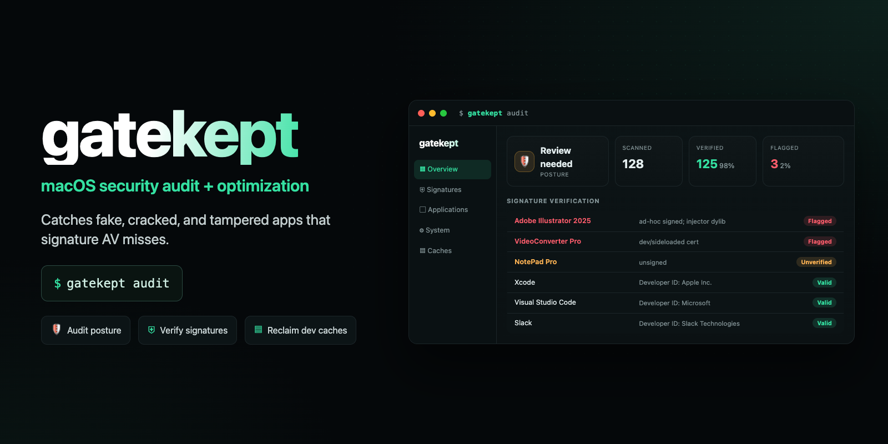

# gatekept

**macOS security audit & optimization — catches the threats signature antivirus misses.**

**Runs as a plain CLI, a [Claude Code](https://www.anthropic.com/claude-code) skill, *and* an [OpenAI Codex](https://openai.com/codex) skill.**


[](https://github.com/myusufyilmaz/gatekept/actions/workflows/ci.yml)


> **Why this exists.** During a real cleanup, a planted fake *Adobe Illustrator* — ad-hoc signed, carrying an injected `CoreInject.dylib` loader — was scanned by **ClamAV with 3.6 million signatures** and reported **clean**. Apple's own `codesign --verify` + `spctl` flagged it in **seconds**.
>
> **Signature antivirus does not detect impersonation. Code-signature verification does.** `gatekept` leads with the check that actually works.

---

## What it does

### `gatekept audit` — read-only security audit
- **Hardening posture** — SIP, Gatekeeper, Firewall, FileVault, XProtect version
- **App signature sweep** ⭐ — flags ad-hoc signed apps, dev/sideloaded certs, injector dylibs, and unknown-signer + Gatekeeper-rejected apps — the real fake/cracked-app fingerprint. Runs **in parallel** across all CPU cores.
- **Deep persistence audit** — for every LaunchAgent & LaunchDaemon, resolves the target binary and **code-signs it**, flagging unsigned / ad-hoc / user-writable-path executables (skips stale plists and SIP-protected Apple entries)
- **Shell-config hijack scan** — `.zshrc` / `.zshenv` / `.bash_profile` etc. for pipe-to-shell, base64-decode, and reverse-shell patterns
- **Login Items / BTM persistence** — code-signs every Login Item (flags ones launched from `~/Downloads` or temp, and unsigned/ad-hoc), plus **cron jobs** and legacy **login/logout hooks** (the Background-Task-Management-era + AdLoad vectors)
- **Malware-staging sweep** — unsigned / ad-hoc executables dropped in `/tmp` — the **AMOS / ClickFix** drop zone
- **Downloads scan** — flags unsigned / ad-hoc / Gatekeeper-rejected `.app` bundles sitting in `~/Downloads` (cracked apps and stealers land here *before* they're moved to /Applications)
- **Notarization + hardened-runtime** counts, live **CPU / swap** snapshot
- **`--json`** machine-readable output; **exit code 3** when anything is flagged (CI/automation-friendly)

> **Tuned to today's threats.** AMOS / Atomic Stealer (~40% of macOS malware in 2025) spreads via **ClickFix** lures that drop ad-hoc-signed payloads in `/tmp` and persist via **Background Task Management** login items — precisely the surfaces these checks cover.

### `gatekept optimize` — reclaim space (dry-run by default)
- Reports & (with `--apply`) clears regenerable dev caches: npm, pnpm, pip, Homebrew, Xcode DerivedData, simulator caches
- Deletes only **unavailable** iOS simulators
- Memory-pressure report with actionable guidance

### `gatekept report` — live HTML dashboard
Generates a **self-contained HTML report** and opens it in your browser — security posture, scanned / verified / flagged metrics, a per-app signature table, notarization + hardened-runtime counts, reclaimable caches, and memory pressure. No server, no dependencies; pure local file.

> The generated report contains your real machine/app data — it is written to `$TMPDIR` and **git-ignored**. Never commit it.

### `gatekept inspect <app>` — is this unsigned app safe?
Not every unsigned app is malware — open-source and self-built apps are **ad-hoc / linker-signed** by the compiler. `inspect` runs a **deep static risk analysis** of a single app and returns a **LOW / MEDIUM / HIGH** verdict. It checks notarization; whether an ad-hoc signature is compiler-applied (benign) or **manually re-signed** (crack pattern); injector dylibs; risky **entitlements** (`get-task-allow`, `disable-library-validation`); non-system linked dylibs; **suspicious strings** (osascript, `/tmp`, keychain access); download provenance; and — if you set `VT_API_KEY` — a **VirusTotal** hash-reputation lookup.

```bash
gatekept inspect ~/Downloads/Something.app
```

### `gatekept scan` — optional ClamAV layer
Known-malware signatures — complements, does not replace, the signature sweep.

---

## Install

**Homebrew (recommended):**
```bash
brew install myusufyilmaz/tap/gatekept
gatekept audit
```

**Or clone and run — zero dependencies:**
```bash
git clone https://github.com/myusufyilmaz/gatekept.git
cd gatekept
bin/gatekept audit

# see what could be cleaned (no changes)
bin/gatekept optimize

# actually clean caches
bin/gatekept optimize --apply
```

Optional — put it on your PATH:
```bash
ln -s "$PWD/bin/gatekept" /usr/local/bin/gatekept   # or ~/bin
gatekept full
```

### Use it as a Claude Code skill
```bash
git clone https://github.com/myusufyilmaz/gatekept.git ~/.claude/skills/gatekept
```
Then ask Claude: *"security scan my mac"* or *"optimize my mac"*.

### Use it as a Codex skill
```bash
git clone https://github.com/myusufyilmaz/gatekept.git ~/.codex/skills/gatekept
```
Then ask Codex: *"Use $gatekept to security scan my Mac"* or simply
*"security scan my mac"*.

For local development, symlink your checkout instead of cloning twice:
```bash
mkdir -p ~/.codex/skills
ln -s "$PWD" ~/.codex/skills/gatekept
```

---

## Commands

| Command | Effect | Writes? |
|---|---|---|
| `gatekept audit` | full security audit | ❌ read-only |
| `gatekept audit --json` | same, machine-readable JSON | ❌ read-only |
| `gatekept report` | HTML dashboard, opens in browser | ❌ read-only |
| `gatekept inspect <app>` | deep risk analysis of one app (LOW/MED/HIGH) | ❌ read-only |
| `gatekept optimize` | report reclaimable caches | ❌ read-only |
| `gatekept optimize --apply` | clean caches + unused sims | ✅ caches only |
| `gatekept scan` | ClamAV known-malware scan | ❌ read-only |
| `gatekept network` | listening ports + established connections | ❌ read-only |
| `gatekept hosts` | `/etc/hosts` + DNS hijack check | ❌ read-only |
| `gatekept extensions` | third-party system extensions + kexts | ❌ read-only |
| `gatekept updates` | macOS / XProtect / Homebrew patch status | ❌ read-only |
| `gatekept quarantine` | quarantined downloads + where they came from | ❌ read-only |
| `gatekept update-check` | check for a newer gatekept release | ❌ read-only |
| `gatekept full` | audit + optimize (dry-run) | ❌ read-only |
| `gatekept --help` / `--version` | help / version | ❌ |

---

## Triaging a flagged app

A real vendor app shows a `Developer ID Application: …` authority **and** a TeamID **and** is Gatekeeper-accepted:

```bash
codesign -dvvv "/Applications/Suspect.app" | grep -E 'Authority|TeamId|adhoc'
spctl -a -t exec -vv "/Applications/Suspect.app"
```

| Signal | Meaning |
|---|---|
| `Signature=adhoc` | self-signed locally — no real certificate |
| `TeamIdentifier=not set` | no vendor team — fake |
| `*Inject*.dylib` in `Contents/MacOS` | code-injection loader (cracked-app pattern) |
| `Apple Development:` cert | sideloaded / repackaged build |
| `codesign-fail` **+** Gatekeeper-rejected | tampered |

**Remove to Trash (reversible) — never `rm -rf`:**
```bash
mv "/Applications/Bad.app" "$HOME/.Trash/Bad.app (untrusted)"
```

---

## Security model

- **Read-only by default.** Only `optimize --apply` writes, and only to regenerable package-manager caches via their own tools (`npm cache clean`, `brew cleanup`, …). It never deletes user files, app data, or documents.
- **No `rm -rf`.** Removal of suspicious apps is your decision, to Trash.
- **Cloud-safe.** The iCloud / Google Drive `CloudStorage` mount is excluded from every scan, so nothing force-downloads your cloud files.
- **No dependencies, no network** (except the optional, user-invoked ClamAV). Pure Bash over Apple's built-in tools.
- **Auditable.** One readable script — `shellcheck`-clean. Read it before you run it.

See [SECURITY.md](SECURITY.md) for reporting.

---

## Limitations

- `audit` runs one `spctl` assessment per app, parallelized across cores (~30–60 s on a typical install).
- ClamAV is **not** bundled — install separately (`brew install clamav && freshclam`). It catches known-malware hashes, not impersonation.
- Heuristics target the common fake/cracked-app patterns; a sufficiently sophisticated, properly-signed-then-revoked binary can still slip past. This is a strong first line, not a guarantee.

---

## FAQ

**How do I check my Mac for malware for free?**
Run `gatekept audit`. It's a free, open-source, read-only scan that verifies every app's code signature with Apple's `codesign` and `spctl`, audits persistence (LaunchAgents/Daemons, Login Items, cron, shell configs), and checks `/tmp` for dropped payloads. No account, no dependencies.

**Does antivirus detect cracked or pirated Mac apps?**
Usually not. Signature antivirus (including ClamAV) matches *known* malware hashes — a cracked or repackaged app that's merely ad-hoc-signed often scans "clean." Code-signature verification catches it, because the app can't forge a real Developer ID. That's gatekept's core check.

**How do I detect AMOS / Atomic Stealer on macOS?**
AMOS spreads through cracked apps and ClickFix lures, drops ad-hoc-signed payloads in `/tmp`, and persists via Background Task Management login items. `gatekept audit` flags ad-hoc/unsigned apps, unsigned `/tmp` executables, and untrusted login items — the surfaces AMOS uses.

**What is ClickFix and how do I check for it?**
ClickFix tricks you into pasting a Terminal command (often from a fake CAPTCHA) that downloads and runs malware. gatekept can't stop the paste, but it scans the artifacts it leaves — `/tmp` staging binaries and shell-config hijacks — and surfaces them.

**Is gatekept safe to run?**
Yes. `audit`, `report`, and `scan` are strictly read-only. `optimize` is dry-run unless you pass `--apply`, and even then only clears regenerable caches. It never deletes apps or user data, never touches your cloud-storage mount, and makes no network calls (except the optional ClamAV scan). It's one readable, shellcheck-clean Bash script — read it before you run it.

**Does it work with Claude Code and OpenAI Codex?**
Yes — it's a CLI *and* a skill for both. Clone into `~/.claude/skills/gatekept` (Claude Code) or `~/.codex/skills/gatekept` (OpenAI Codex), then ask your agent to "security scan my Mac."

---

## Credits & inspiration

- **[Trail of Bits — Claude Code security skills](https://github.com/trailofbits/skills)** — gold-standard security skills (Mach-O / YARA aware). Complementary for deep binary analysis.
- **[ClamAV](https://www.clamav.net/)** (Cisco Talos) — optional known-malware layer, called as an external binary (not bundled).
- **Apple** `codesign` / `spctl` / `fdesetup` — the verification tools doing the real work.
- Skill-vetting tools worth knowing: [claude-skill-antivirus](https://github.com/claude-world/claude-skill-antivirus), [Repello SkillCheck](https://repello.ai/blog/claude-code-skill-security).

This is **original work** — it orchestrates Apple's built-in tools and credits the ecosystem that informed it; it does not copy code from the above.

---

## Contributing

PRs welcome — especially more fake-app fingerprints, Apple Silicon edge cases, and false-positive tuning for Electron/Chromium apps.

## License

[MIT](LICENSE).
